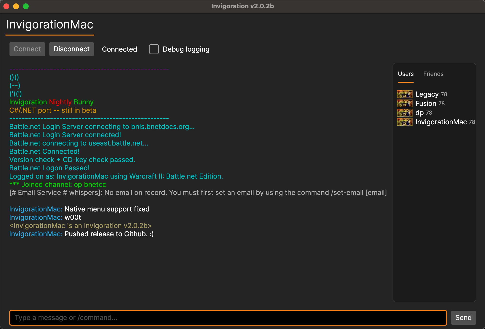
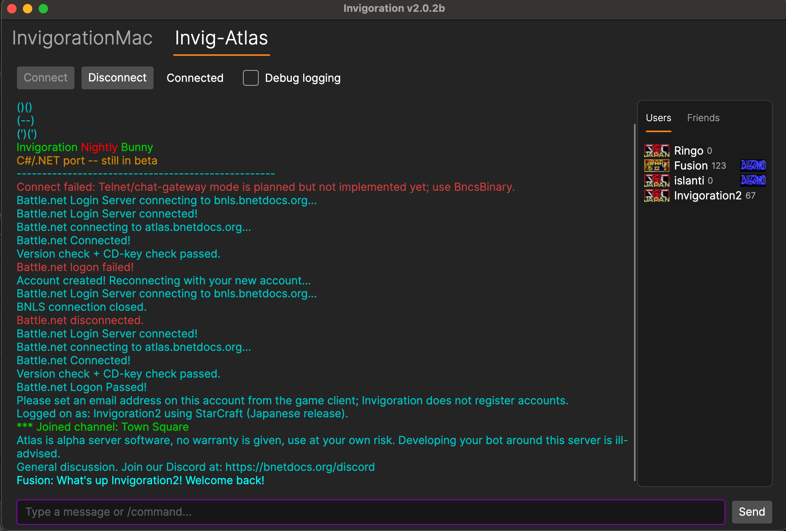
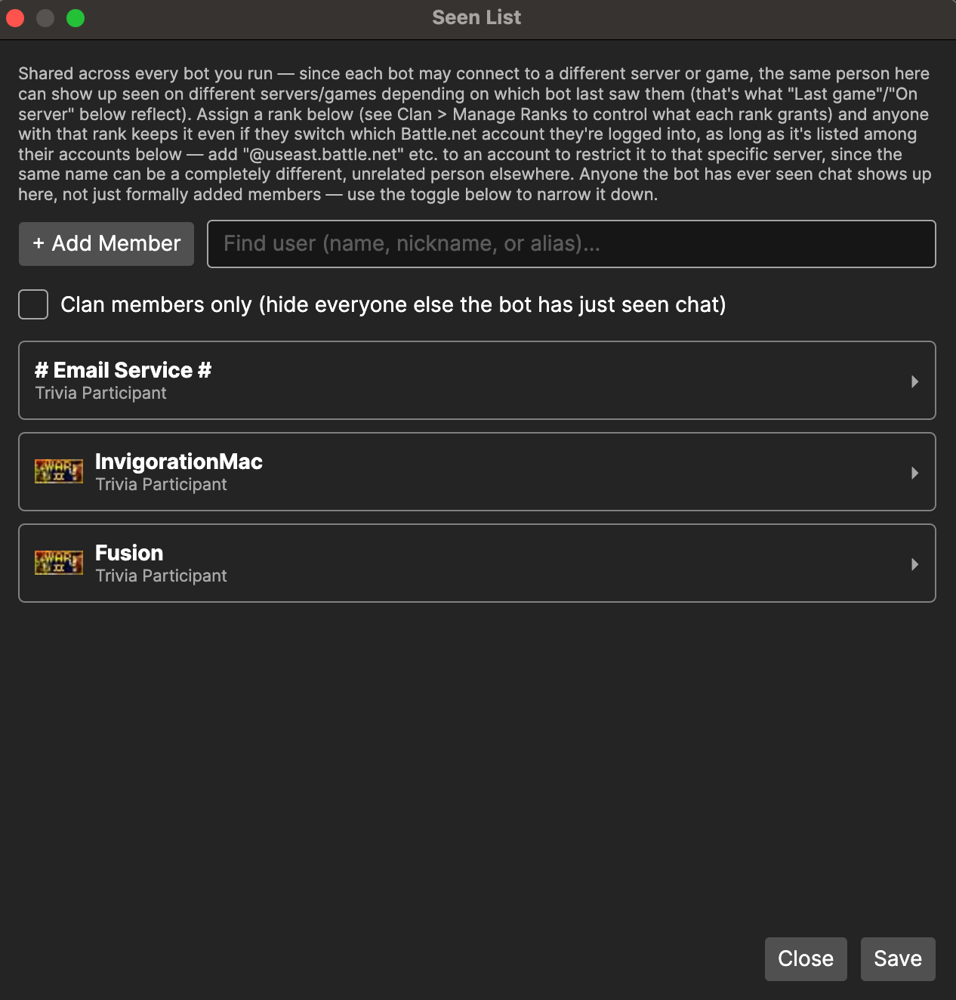
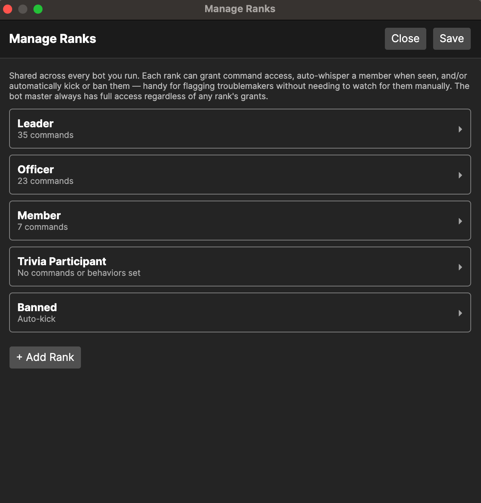
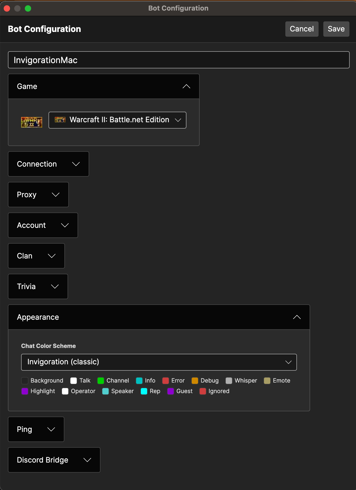
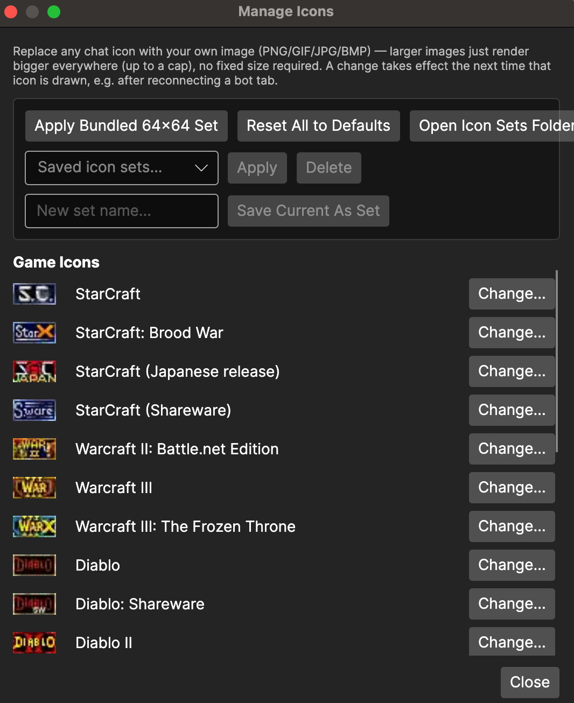

# Invigoration

A complete rewrite of the classic Battle.net bot, brought to the .NET era — 15 years late, but built with a lot of help from AI. Runs natively on **Windows**, **macOS** (signed and notarized — opens with no Gatekeeper warnings), and **Linux**.

<p align="center">
  
</p>

## Features

- Multi-bot, multi-server: run several bots side-by-side in tabs, each on its own server, game, and account
- Shared clan roster with configurable ranks — per-rank command access, auto-whisper/auto-kick/auto-ban
- Trivia across 6 categories (Diablo, Warcraft, StarCraft, Blizzard, Pop Culture, Music), with editable question packs
- Per-bot custom chat color schemes, plus a full icon manager for game/status icons
- BNCS friends list, flood protection, SOCKS5/HTTP CONNECT proxy support, auto-connect/auto-reconnect
- Config saved as JSON, with multi-profile loading

<p align="center">
  
</p>

### Clan & ranks

Shared across every bot you run — assign ranks that grant command access and automatic actions, and keep a searchable log of everyone the bot has ever seen chat.

<p align="center">
  
  
</p>

### Bot configuration & color schemes

Each bot gets its own settings — connection, proxy, account, clan, trivia — plus a fully customizable chat color scheme.

<p align="center">
  
</p>

### Icon manager

Swap any chat icon for your own image — game icons, status icons, all overridable per-set, with no fixed size required.

<p align="center">
  
</p>

## Download

Grab the latest build from the [Releases page](https://github.com/tagban/invigoration/releases) — Windows, macOS (arm64 and Intel), and Linux builds are all published there.

## Building from source

Requires the [.NET 10 SDK](https://dotnet.microsoft.com/download).

```bash
cd dotnet
dotnet build Invigoration.slnx
```

macOS releases are built, signed with a Developer ID certificate, and notarized via `dotnet/build-macos.sh`. Linux releases are packaged via `dotnet/build-linux.sh`. See those scripts for the full pipeline.

## Status

Actively developed, still labeled beta — expect rough edges. Feedback and bug reports welcome via [Issues](https://github.com/tagban/invigoration/issues).
