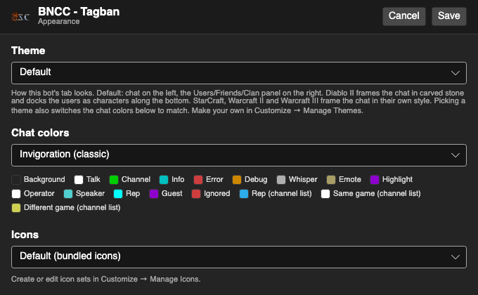
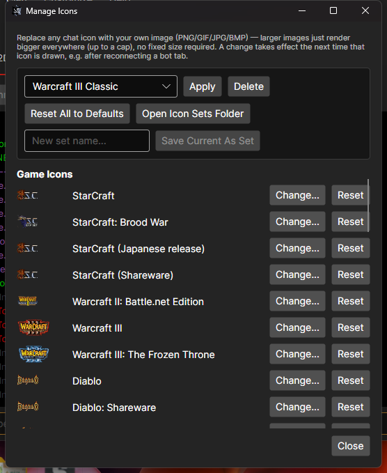
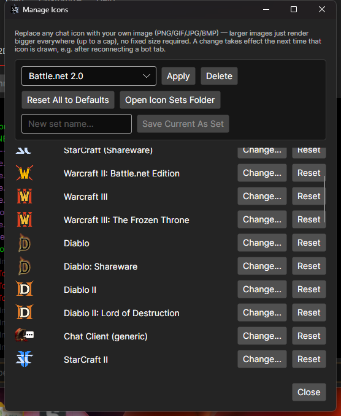
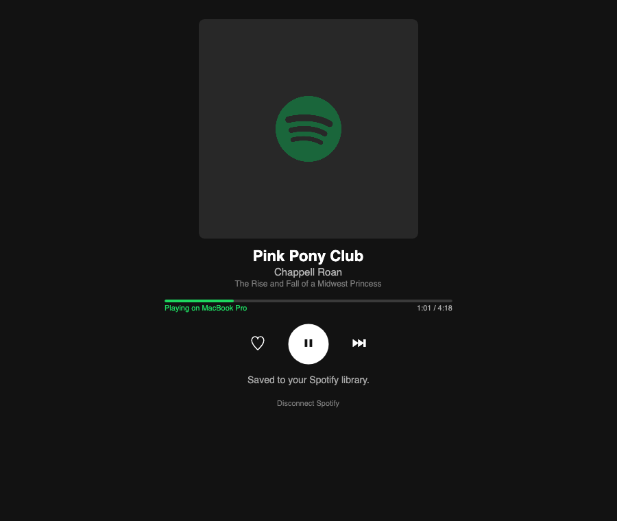
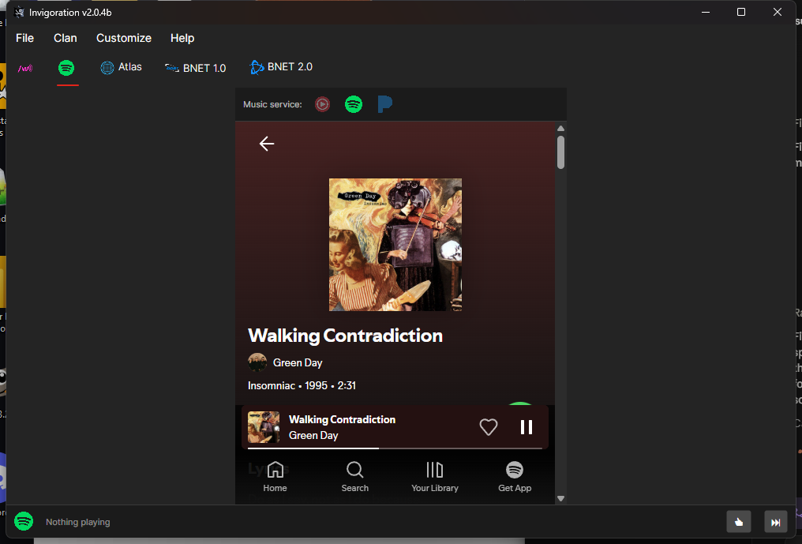
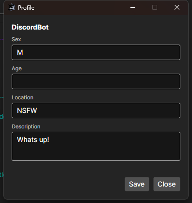

# Invigoration

A complete rewrite of the classic Battle.net bot, brought to the .NET era — 15 years late, but built with a lot of help from AI. Runs natively on **Windows**, **macOS** (signed and notarized — opens with no Gatekeeper warnings), and **Linux**.

<p align="center">
  
</p>

## Features

- Multi-bot, multi-server: run several bots side-by-side in tabs, each on its own server, game, and account
- **StarCraft II connectivity** (limited but working) over Blizzard's real modern protocol — login, multi-channel chat, whispers, and friends. SC:Remastered and Warcraft III: Reforged are selectable as products on the same connection but not yet actually working — coming soon
- Shared clan roster with configurable ranks — per-rank command access, auto-whisper/auto-kick/auto-ban
- Trivia across 6 categories (Diablo, Warcraft, StarCraft, Blizzard, Pop Culture, Music), with editable question packs
- Per-bot custom chat color schemes, plus a full icon manager for game/status icons
- BNCS friends list, flood protection, SOCKS5/HTTP CONNECT proxy support, auto-connect/auto-reconnect
- Config saved as JSON, with multi-profile loading

<p align="center">
  
</p>

### Clan & ranks

Shared across every bot you run — assign ranks that grant command access and automatic actions, and keep a searchable log of everyone the bot has ever seen chat.

<p align="center">
  
  
</p>

### Bot configuration

Each bot gets its own settings — connection, proxy, account, clan, trivia, and more.

<p align="center">
  
</p>

### Chat color schemes

Every chat message category — usernames, whispers, errors, and more — gets its own color, fully customizable per bot.

<p align="center">
  
</p>

### Icon manager

Three switchable bundled icon sets — Battle.net 1.0 Classic, Warcraft III Classic, and Battle.net 2.0 (the default) — plus swap any individual chat icon for your own image, or save your own named set.

<p align="center">
  
  
  
</p>

### Music player

An embedded YouTube Music, Spotify, or Pandora player, controllable from chat (`skip`/`thumbsup`/`thumbsdown`/`nowplaying`) or an optional playback bar docked at the bottom of the whole window — visible no matter which bot tab you're looking at.

<p align="center">
  
  
</p>

### StarCraft II (SC:Remastered / WC3:Reforged coming soon)

Set a bot's **Product** to StarCraft II in its Configuration window and Connect — it logs in through Blizzard's modern Battle.net service instead of the classic protocol the rest of this app uses, so a few things work differently. StarCraft: Remastered and Warcraft III: Reforged are already selectable in that same list (they share the underlying connection), but aren't actually working yet — that's coming in a future release.

- **Battle.net credential profiles**: instead of each bot having its own implicit login, a bot picks a named **Battle.net Profile** from a dropdown in its Configuration window. Point two bots at the same profile to share one signed-in login (handy for running multiple bots on the same account); give a bot its own profile for a separate login. Manage profiles — rename, sign in, remove — from **Customize → Manage Battle.net Profiles...**.
- **Multi-channel chat**: unlike classic Battle.net's single-channel chat, these products can be joined to several channels at once (up to 6). Each joined channel gets its own sub-tab with its own chat log and user list; use the **+** button above the sub-tabs to join another public or private channel, and the **×** on a sub-tab to leave it. The bot remembers which channels it had open and rejoins them on reconnect.
- Trivia, when running in one of these channels, only accepts answers from that same channel — not from a different one the bot also happens to be in.

### Whisper tabs

Every bot has its own **Whispers** tab, and there's a compact **`/w`** tab at the very top of the window that aggregates whisper conversations across *every* connected bot — click a name in either to read the conversation and reply. You can also right-click a name in a bot's Friends list to pop up a small "Whisper" compose box without leaving the list.

### Battle.net profile & right-click actions

Right-click a name in the classic Users list or the Friends list for Whisper, Profile Info, Clan Rank, Squelch, and Add Friend. Profile Info opens a real Battle.net 1.0 profile — Sex/Age/Location/Description — editable for your own account.

<p align="center">
  
</p>

### Bot tab groups

Give two or more bots the same **Tab group** name in their Configuration window (e.g. all the bots on one server) and they collapse into a single top-level tab with their own sub-tabs inside — handy for decluttering the tab strip when you're running a lot of bots at once. Leave it blank to keep a bot as its own individual tab.

A small dot appears on any tab (bot, group, channel, or whisper) that has new activity you haven't looked at yet.

### Discord Bridge

Relay chat between a Battle.net channel and a Discord channel, in either or both directions, per bot. The bridge connects and disconnects automatically alongside that bot's own Connect/Disconnect — there's no separate Discord button.

**Setup:**

1. Create a Discord application at the [Discord Developer Portal](https://discord.com/developers/applications) → **New Application**.
2. Open the **Bot** page → **Reset Token** and copy it. Treat it as a secret — anyone with the token can control the bot.
3. On the same **Bot** page, enable **Message Content** under *Privileged Gateway Intents*. This is required — without it, messages from other Discord users arrive with empty text and nothing relays.
4. Open **OAuth2 → URL Generator**, check the `bot` scope and the `Send Messages` + `View Channel` permissions, then open the generated URL to invite the bot to your server.
5. In Discord, turn on Developer Mode (**User Settings → Advanced**), then right-click the channel you want bridged and **Copy Channel ID**.
6. In Invigoration, open that bot's **Configuration → Discord Bridge** and fill in:
   - **Enabled**
   - **Discord bot token** — from step 2
   - **Discord channel ID** — from step 5
   - **Relay delay (seconds)** — minimum gap between relayed messages in each direction, flood protection
   - **Relay Battle.net chat to Discord** / **Relay Discord messages to Battle.net** — toggle either direction independently
7. Save the config, then Connect the bot as normal.

**Troubleshooting:**

- *Discord shows a 401/Unauthorized error after connecting successfully* — the token was regenerated or auto-revoked (Discord invalidates a token the moment it's detected exposed anywhere public, e.g. a repo or paste site). Grab a fresh token from the Bot page and restart the bot.
- *Discord → Battle.net relay is silent, but Battle.net → Discord works* — the **Message Content** intent (step 3) isn't enabled; Discord withholds message text from bots without it.
- *Nothing relays either direction* — double-check the Channel ID is a channel the bot was actually invited into (step 4), and that both relay-direction checkboxes are on.

## Download

Grab the latest build from the [Releases page](https://github.com/tagban/invigoration/releases) — Windows, macOS (arm64 and Intel), and Linux builds are all published there.

## Building from source

Requires only the [.NET 10 SDK](https://dotnet.microsoft.com/download) — StarCraft II/SC:R/WC3:R connectivity comes from the prebuilt [Stimpak](https://www.nuget.org/packages/Stimpak) NuGet package (Windows, macOS, and Linux native binaries all ship in the package itself), so no Rust toolchain or git submodule is needed.

```bash
git clone https://github.com/tagban/invigoration.git
cd invigoration/dotnet
dotnet build Invigoration.slnx
```

macOS releases are built, signed with a Developer ID certificate, and notarized via `dotnet/build-macos.sh`. Linux releases are packaged via `dotnet/build-linux.sh`. Windows releases are packaged as a single-file exe via `dotnet/build-windows.ps1`. See those scripts for the full pipeline.

## Acknowledgments

StarCraft II, StarCraft: Remastered, and Warcraft III: Reforged connectivity is powered by [Stimpak](https://github.com/ncarrillo/superiority), ncarrillo's native Battle.net client library.

The classic Battle.net 1.0 (BNCS) protocol implementation wouldn't have been possible without [BNETDocs.org](https://bnetdocs.org) and [github.com/BNETDocs](https://github.com/BNETDocs) — their continued effort to document and maintain Battle.net 1.0's protocol, long after Blizzard stopped supporting it, is what this whole side of the app is built on.

## Status

Actively developed, still labeled beta — expect rough edges. Feedback and bug reports welcome via [Issues](https://github.com/tagban/invigoration/issues).
